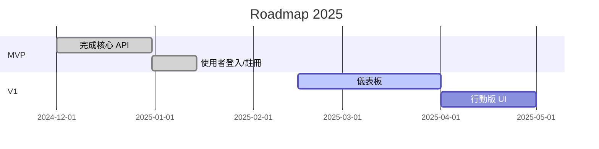

# 📂 Urosmart
>UroSmart住院病患尿袋尿量監控警示系統
<p align="center">
  
  <a href="https://github.com/usertracychen/Portfolio/actions/workflows/ci.yml"></a>
  <a href="LICENSE"></a>
  <a href="https://github.com/usertracychen/Portfolio/stargazers"></a>
</p>

## 動機：
1.	難以及時判斷異常排尿情況
2.	滿袋或洩漏時的緊急風險
3.	無法長期保存與分析尿量資料
4.	失能或長期臥床者照護壓力大
5.	人工巡視不定期且易疏漏
   
## 目的：
1.	系統旨在透過 ESP8266 搭配 HX711 與 load cell 進行尿袋重量（或尿量）監控，並藉由後端服務進行數據儲存與警示，最終透過 Web 與 android app 供護理人員及家屬即時查詢狀態與接收異常通知。
2.	系統主要應用於預防尿液逆流、感染及早期發現排尿異常，提升護理效率。


## 材料：

硬體
1.	NodeMCU（ESP8266）
2.	HX711重量感測模組
3.	Load Cell稱重感測元件
4.	蜂鳴器

<span>接線說明</span>


軟體工具
1.	python Django
2.	html/CSS/bootstrap
3.	MYSQL Workbench
4.	VSCODE
5.	Arduino IDE

## 系統架構：


## 資料庫規劃：


## 結果展示：

# 📂 Project&nbsp;Title

> 一句話描述你的專案宗旨與價值主張


---

## 📑 目錄

- [背景](#背景)
- [功能特色](#功能特色)
- [快速開始](#快速開始)
- [使用說明](#使用說明)
- [技術棧與工具](#技術棧與工具)
- [專案結構](#專案結構)
- [畫面截圖](#畫面截圖)
- [Roadmap](#roadmap)
- [貢獻指南](#貢獻指南)
- [授權](#授權)
- [聯絡方式](#聯絡方式)

---

## 背景

在這段簡要描述專案的緣起、解決的痛點，以及使用情境。

## 功能特色

| 類別 | 描述 |
|------|------|
| 🚀 **快速** | 99% 的動作都在 100ms 內完成 |
| 🛡 **安全** | OAuth2 + JWT 完整權限控管 |
| 🌏 **跨平台** | 同時支援 Web、iOS、Android |

- [x] 功能 1
- [x] 功能 2
- [ ] 功能 3（開發中）

## 快速開始

```bash
# 1. Clone 專案
$ git clone https://github.com/usertracychen/Portfolio.git
$ cd Portfolio

# 2. 安裝相依套件
$ npm install        # 或 pip install -r requirements.txt

# 3. 啟動開發環境
$ npm run dev        # 或 python manage.py runserver
```

> **Prerequisites**
> - Node >= 18 / Python >= 3.10
> - Docker (可選)

## 使用說明

```bash
# 範例指令
$ portfolio --input data.csv --output report.pdf
```

更多範例可以參考 [`examples/`](examples/) 目錄。

## 技術棧與工具

- **前端**：React 18 · Tailwind CSS · Vite
- **後端**：Django 5 · REST Framework · PostgreSQL
- **DevOps**：Docker · GitHub Actions · AWS EC2

## 專案結構

```
Portfolio/
├─ docs/            # 說明文件與圖片
├─ src/             # 原始碼
│  ├─ api/
│  ├─ components/
│  └─ pages/
├─ tests/           # 測試
└─ ...
```

## 畫面截圖

| 首頁 | 手機版 |
|------|--------|
|  |  |

## Roadmap



## 貢獻指南

1. Fork → 新建分支 → Commit → Push → Pull Request
2. PR 前請確保 `npm run lint && npm run test` 全數通過
3. 詳細規範請見 [`CONTRIBUTING.md`](CONTRIBUTING.md)

## 授權

本專案採用 MIT License - 詳見 [`LICENSE`](LICENSE) 檔案。

## 聯絡方式

| 角色 | 聯絡人 | e‑mail |
|------|--------|--------|
| Maintainer | Tracy Chen | usertracychen@example.com |

<p align="center">
  Made with ❤️  in Taiwan
</p>


